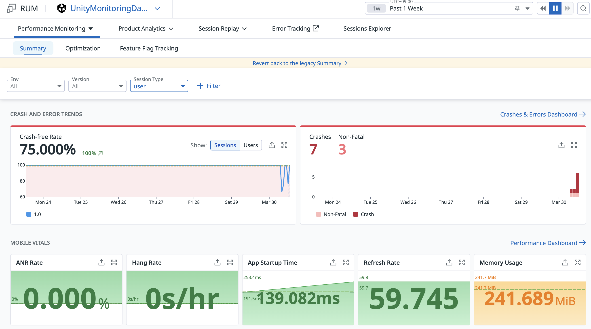

# UnityMonitoringDatadog

This project tests the types of errors that can be processed by the [Datadog Unity SDK](https://github.com/DataDog/unity-package).

<div style="text-align: center;">
    
    
</div>

## Prerequisites

- **Unity 6 LTS** – [Download here](https://unity.com/releases/editor/archive)
- **CocoaPods** – [Getting Started Guide](https://guides.cocoapods.org/using/getting-started.html)

## Getting Started

1. **Create a Datadog account** by visiting [Datadog](https://www.datadoghq.com/).
   - A 2-week trial is available.
2. **Create a "Unity" application** in Datadog from the following URL:  
   [Create Application](https://ap1.datadoghq.com/rum/application/create)
3. **Configure Unity:**
   - Navigate to **Project Settings** → **Datadog** (left-hand side).
   - Add your **Client Token**, **Environment (env)**, and **RUM Application ID** received from the previous step.
   - Ensure the "Datadog Site" dropdown is correctly set.

## Building and Testing

- Error tracking **does not work in the Unity Editor**.
- Build for **iOS or Android** and test on a physical device.
- Since the project is using CocoaPods, **open the workspace file (`.xcworkspace`) in Xcode** instead of the project file to avoid build errors.

## Sending Symbols to Datadog

Symbol files are required to map memory addresses in Datadog reports to source code lines.

### Uploading Symbol Files

1. Ensure you have an **API Key** set up:  
   [Datadog API Keys](https://docs.datadoghq.com/account_management/api-app-keys/#client-tokens)
2. If **Output Symbol Files** is enabled in Datadog project settings, the `.dsym` file and mappings will be available in the iOS build folder after each build.
3. Navigate to the build folder and run:

   ```sh
   export DATADOG_API_KEY="YOUR_API_KEY"
   export DATADOG_SITE="YOUR_DATADOG_SITE"
   npx @datadog/datadog-ci unity-symbols upload --ios
   ```
   *(Replace `YOUR_API_KEY` and `YOUR_DATADOG_SITE` with your actual values.)*

## Troubleshooting

For CocoaPods-related issues, check the [troubleshooting guide](https://github.com/googlesamples/unity-jar-resolver/blob/master/troubleshooting-faq.md).

## TODOs

- Test the project on **Android**.

## More Information

- Official Datadog setup guide for Unity:  
  [Datadog Unity Setup](https://docs.datadoghq.com/real_user_monitoring/mobile_and_tv_monitoring/unity/setup/)
- Check `SampleError.cs` and the `Plugins` folder for error types.
- Sample errors were borrowed from:
  - [Unity Backtrace Sample](https://github.com/unity3d-jp/BacktraceUnitySample)
  - [Bugsnag Unity](https://github.com/bugsnag/bugsnag-unity)

## License

This sample is released under the **MIT License**. See `LICENSE.txt` for details.

The **Datadog Unity package** is licensed under **Apache 2.0**. More details:  
[Datadog Unity SDK](https://github.com/DataDog/unity-package)

